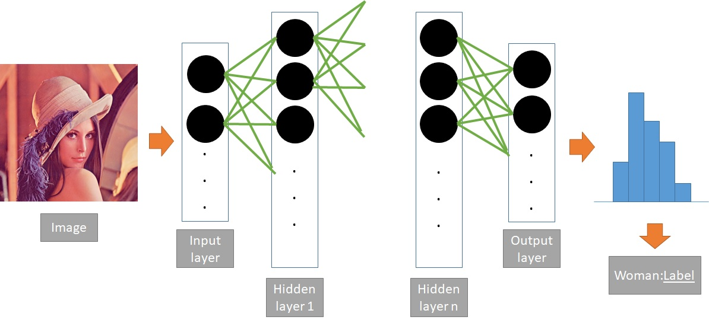
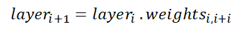
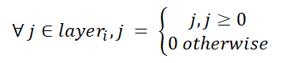
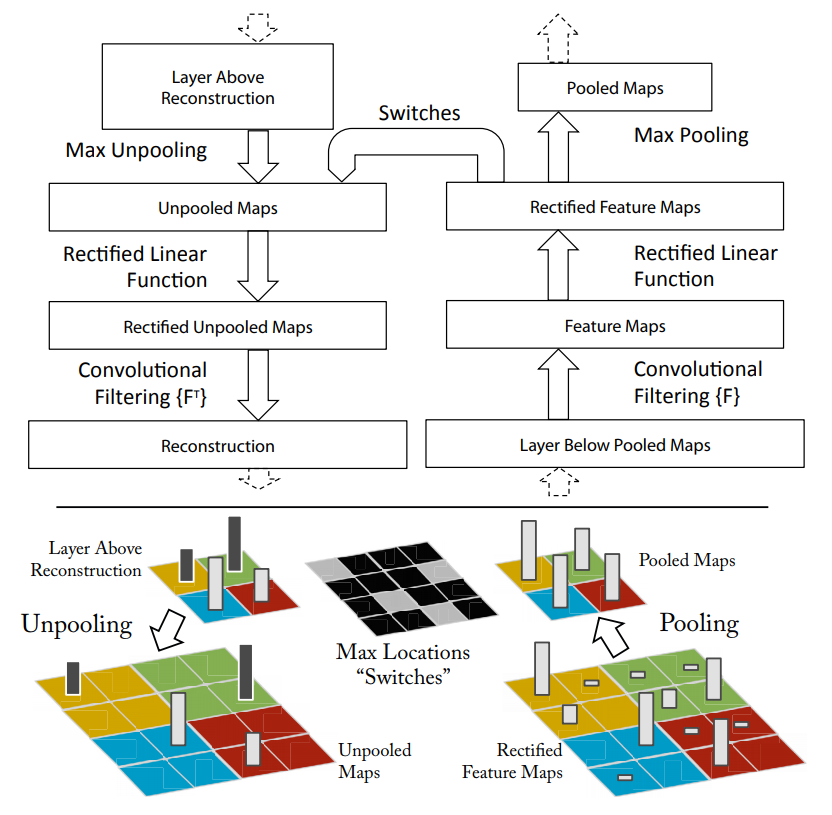
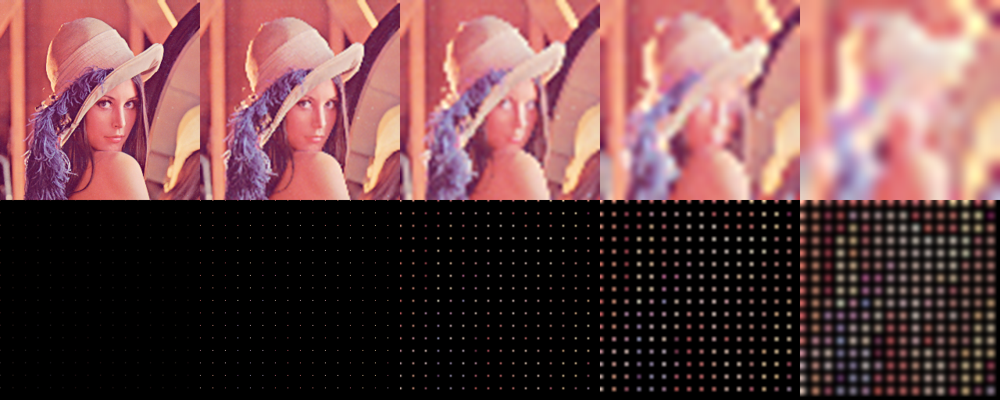
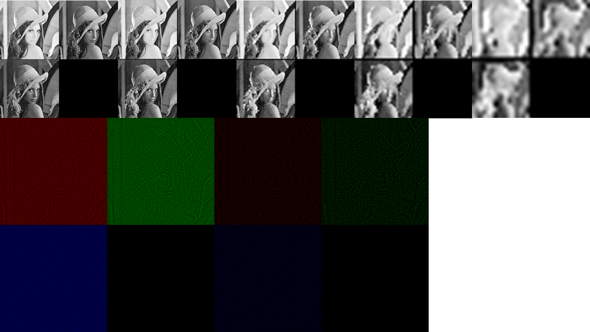

# Deconvolutional Neural Network

> **Note**: if you are interested in using DeconvNet effectively, you can dive immediately into [experiments.ipynb](experiments.ipynb), implemented in Keras with Tensorflow backend. Even though it departs from the original model, it visually and theoretically works better, according to this [paper](https://arxiv.org/pdf/1412.6806.pdf%20(http://arxiv.org/pdf/1412.6806.pdf)). This should be applicable for most networks, though it is tricky to apply on network has layers connecting to more than one other layer, e.g. Inception V3. If that's the case, check out this [example](https://github.com/hovinh/LayeredExplanationsFramework/blob/master/code/DogFish_VGG16.ipynb).

As part of an on-going project, I need to find a way to map value of an arbitrary layer back to its previous layer. Initially, it is meant to apply on a general architecture, **Fully Connected Neural Network** (NN). However, reconducting a well-known experiment seems to be a more reasonble approach to me. Therefore, I choose **Convolutional Neural Network** (CNN), one of two popular variants of NN, to test on. To be precise, I would call it **Deconvolutional Neural Network** (DeCNN) for this is a CNN integrated with an additional reversed process.

## Architecture
### Neural Network in general

At first sight, one could treat NN as a simplified version of biological neurons, which consists of active units and bridges connect them to transmit signal. Somehow, for a particular task, with a given sufficient amount of samples, the neurons could automatically extract essential pattern through learning process - interaction between set of neurons.

Formally, a NN is defined by layers: input layers, hidden layers, and output layers. Within each layer is a set of unjoined nodes (neurons). The different in naming based on the data a layer has to handle. Take input layer for example, it could be an image vectoried into 2-dimension vector in grayscale form or higher dimensions as in RGB. The output layer on the other hand, is a prediction of label to assign to input image. Conventionally, it is a probability distribution vector over all possible labels. Last but not least, the hidden layer is where all learning activities happen, which has no desirable explanations so far and usually considered as a black box. These layers connect to each other via weights (bridges), with each end is a node in layer.

  
    
  <b>General Architecture of Neural Network</b> 

Despite the lack of understanding, one can turn NN into a strong classifier with **Stochastic Gradient Descent** (SGD), an approximation method to minimize the number of mismatches between prediction and groundtruth. Thanks to this invention, most of the research nowadays mainly focus on modifying network's architecture or loss function. This algorithm consists of 2 phases: forward and backword. While forward phase spreads input value through the whole network until the output layer, backward phase calculates the loss in prediction and use it to accumulatively updates weights. It keeps iterating until a desired condition is met, for example number of loops or a specific threshold of loss. Note that most of all operations execute here are simply matrix multiplication (linear), for instance

  

and activation function (non-linear), such as

  

### Convolutional Neural Network

Take over the idea of NN, CNN contributes 2 things:
- address the problem of storing a vast amount of weights in the original model, replace with small size filters (or kernels).
- divide architecture into 2 sub-components: feature extraction and classifiers. Previously, features are hand-picked before feeding into the NN (this is an art!), whereas now we could leave this job for CNN handles itself. This innovative idea entails two new operations on filters: convolution and pooling.

To explain succintly and accurately, I can do no better than [A guide to convolution arithmetic for deep learning](https://arxiv.org/abs/1603.07285). Long story short, first half part of the network is a sequence of convolution and pooling, which act as image filter to retain solely handy features. Notice that convolution operation is flexible, which can change the the height, width, and depth of following layer. Besides, though it seems to be not the case, convolution is actually still a matrix multiplication. On the contrary, pooling could only reduce height and width, and being a non-linear function instead. The rest of network is conventional NN, which in turn is in charge of classification/prediction task.

  
    
  <b>Architecture of Convolutional Neural Network. Source: http://www.cnblogs.com/BigBallon/p/6701846.html</b> 

### Deconvolutional Neural Network

[Visualizing and Understanding Convolutional Networks](https://www.cs.nyu.edu/~fergus/papers/zeilerECCV2014.pdf) originates the idea of DeCNN, in which the author would like to observe the training process, feature extraction part in specific, by mapping back value of the most active neurons to reconstruct original image. This might provide some clues about which pattern the model is learning, and when the training should stop. One thing for sure, at least in pooling operation, its counterpart is lossy. Max pooling, for instance, can only retain value of maximum in covered area and assign 0 to the others.

  
    
  <b>Architecture of Deconvolutional Neural Network. Source: https://www.cs.nyu.edu/~fergus/papers/zeilerECCV2014.pdf</b> 

## Environment

Tensorflow is my choice of Deep Learning framework. Little did I know, it's quite challenging to implement DeCNN in practice.

## Experiment
### (Max) Pooling - Unpooling

Pooling could have many variants, which is defined on the operation on the covered area of pooling filter. It could be finding a maximum value, or calculating the mean. I choose max pooling for it is widely used and existence of corresponding API in tensorflow.

The effect brought by max pooling is similar to zoom in an image. The deeper the layer, the more pixels are broken. Curves become rough squares, for instance. On the other hand, unpooling aims to reconstruct the original image, based on  two mere pieces of information: positions and value of the maximal pixel in the area.

Note that it's funny how the unpooling function is created for GPU-supported tensorflow only. My effort to reproduce the same result could not surpass the performance requirement, in other words, it's too slow. Finally, I address this issue with an official implementation on GPU and heuristic on CPU. This set of experiments simply put a sequence of poolings following by unpoolings to illustrate how this technique works.

  
    
  <b>Unpooling heuristic on CPU. Instead of storing switch and sustaining the cost of recovering previous layers, center pixel would be chosen as representative for each covered area. Source: https://github.com/andreaazzini/segnet.tf/blob/master/src/convnet.py</b> 

  
    
  <b>Unpooling using tf_cnnvis library on CPU. This library supports visualization of each layer in forward and backward process of any CNN, which is based on the original paper. It does not provide API to collect outcome of unpooling though. Source: https://github.com/InFoCusp/tf_cnnvis</b> 

  
    
  <b>Unpooling on GPU. This is a proper way to implement DeCNN on tensorflow. Source: https://github.com/fabianbormann/Tensorflow-DeconvNet-Segmentation/blob/master/DeconvNet.py
</b> 

The order of operations is as follows: in the top row, from left to right is 4 poolings apply on the image continuously. The produced image is then feed into unpooling 
order of operation
one last layer
for the sake of simple, see orinigal image in 
### Convolution - Deconvolution

Deconvolutional layer is in fact pseudo-deconvolutional: it is simply transposing convolutional layers in feed-forward phase vertically and horizontally. 

### Deconvolutional Neural Network

Apart from pooling and deconvolutional layer, any layer that has ReLU activation applied in the feed-forward phase also has ReLU activation in the backward phase.

## Feedback
Please feel free to contact me via my email: hovinh39@gmail.com